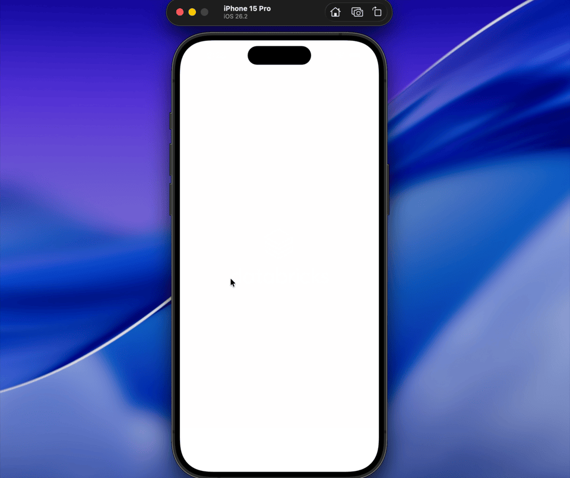

# Mortgage Expert AI



A premium iOS application powered by GenAI to provide expert mortgage guidance. This app leverages Amazon Bedrock and a robust data backend to deliver intelligent, real-time responses for mortgage-related queries.

## Key Features
- **AI-Powered Guidance**: Specialized GenAI agent trained on mortgage domains.
- **Real-Time Insights**: Pulling live data from backend services for accurate assistance.
- **Premium Experience**: A high-end, responsive interface designed for professional financial services.

## Technical Architecture
- **Frontend**: Expo / React Native (TypeScript)
- **AI Engine**: Amazon Bedrock
- **Data Backend**: Advanced Data Lakehouse integration

## Getting Started

### Prerequisites
- Node.js (v18+)
- Expo CLI
- iOS Simulator

### Installation
1. Clone the repository
2. Install dependencies:
   ```bash
   npm install
   ```

### Deployment
Start the development server:
```bash
npx expo start
```
- Press **i** to launch on the iOS simulator.

## Features
- **Intelligent Chat Interface**: Clean, high-contrast UI for focused interaction.
- **Dynamic Typing Indicators**: Real-time feedback while the agent processes complex queries.
- **Custom Citations**: Linked sources for verified data points.
